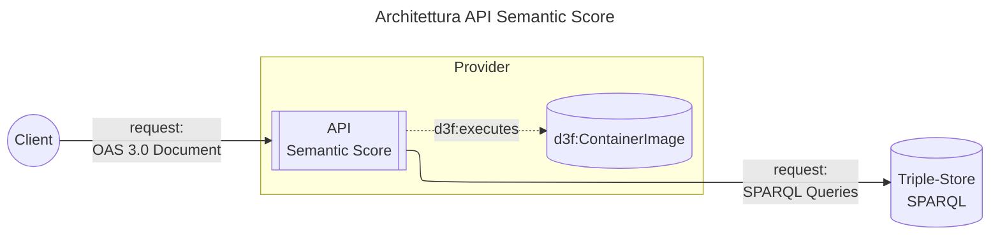

# API Design

## Introduzione

L'API per il calcolo del semantic score è un servizio REST
che calcola il punteggio semantico di documenti OpenAPI 3.0.
Il servizio analizza gli schemi presenti nel documento,
estra le annotazioni semantiche
indicate tramite le [REST API Linked Data Keywords](https://datatracker.ietf.org/doc/draft-polli-restapi-ld-keywords/).
e ne verifica la presenza su un triple-store che espone un'interfaccia SPARQL.

Questa API supporta i progettisti e sviluppatori di API RESTful
nella valutazione del livello di arricchimento semantico
dei propri modelli di dati
e incentiva le pratiche di modellazione semantica.

Per ottenere un Semantic Score basato sugli asset
semantici italiani, è necessario utilizzare
il triple-store pubblicato da <https://schema.gov.it>.

## Requisiti

- Calcolo del Semantic Score per documenti OpenAPI 3.0
- Verifica dello stato del servizio
- Pubblicazione della specifica OpenAPI

## Architettura

Questa API è implementata come un'applicazione
[NestJS](https://nestjs.com/)
e distribuita tramite un container Docker
all'interno del monorepo [schema-editor](https://github.com/teamdigitale/dati-semantic-schema-editor).

L'API espone un'interfaccia REST e si connette a un triple-store SPARQL
per validare le proprietà semantiche dei modelli di dati.

L'applicazione è strutturata in moduli NestJS:

- SemanticScoreModule: Gestisce il calcolo del semantic score.
- HealthModule: Fornisce l'endpoint di health check.
- ConfigModule: Gestisce la configurazione e le variabili d'ambiente.
- ThrottlerModule: Implementa il rate limiting.

Il calcolo del semantic score utilizza la libreria `@teamdigitale/schema-editor-utils` che gestisce:

- la risoluzione dei riferimenti JSON-LD;
- le query verso il server SPARQL;
- il calcolo del punteggio semantico.

Queste funzionalità sono comuni anche al [Schema Editor](../schema-editor/README.md).

Il triple-store di riferimento è [Virtuoso](https://virtuoso.openlinksw.com/).



## Funzionalità

### Verifica dello status del servizio

L'API espone un endpoint di health check
per monitorare lo stato di salute del servizio.

### Pubblicazione dell'OpenAPI 3.0

La specifica dettagliata dell'API è descritta
nel documento OpenAPI disponibile all'URL `/openapi.yaml`.

### Calcolo Semantic Score

L'API espone un endpoint che:

1. Accetta documenti OpenAPI 3.0 in formato YAML o JSON (dimensione massima: 1MB).
2. Valida la struttura del documento OpenAPI.
3. Analizza i modelli di dati presenti in `#/components/schemas`.
4. Calcola il semantic score per ogni modello basandosi sulle proprietà semantiche validate.
5. Restituisce il documento originale arricchito con:
   - `#/info/x-semantic-score`: punteggio semantico globale (media dei punteggi dei modelli);
   - `#/info/x-semantic-score-timestamp`: timestamp del calcolo.

#### Integrazione col Triple-Store

L'API si connette a un triple-store che espone un'interfaccia SPARQL
per validare le proprietà semantiche dei modelli di dati.
Il processo è il seguente:

1. Per ogni modello di dati con `x-jsonld-context`, l'API estrae le proprietà definite
2. Le proprietà vengono validate interrogando il triple-store tramite query SPARQL
3. Il punteggio viene calcolato come rapporto tra proprietà semantiche valide e totale proprietà

L'indirizzo del triple-store è definito tramite la variabile d'ambiente `SPARQL_URL`.

### Service Management

#### Rate Limiting

L'API implementa un sistema di rate limiting utile
a definire dei livelli di servizio:

- Limite: 15 richieste per finestra temporale (configurabile via `THROTTLE_LIMIT`)
- Finestra temporale: 60 secondi (configurabile via `THROTTLE_TTL`)
- Risposta: Status code `429 Too Many Requests` quando il limite viene superato

#### Gestione dei dati di ingresso

- Helmet: Middleware per la sicurezza HTTP
- CORS: Configurabile tramite variabile d'ambiente
- Validazione input: Validazione automatica dei documenti OpenAPI
- Limite delle richieste HTTP: Massimo 1MB per richiesta

## Deployment

Il deployment avviene tramite l'immagine Docker
pubblicata su GitHub Container Registry del repository:
non sono supportate altre modalità di deployment.

### Prerequisiti

- SparQL:
  Assicurarsi che l'endpoint SPARQL sia accessibile dall'ambiente di deployment
- Rate Limiting:
  Regolare i parametri `THROTTLE_LIMIT` e `THROTTLE_TTL` in base al carico atteso
- CORS:
  Configurare `CORS_ORIGIN` con le origini effettive in produzione (evitare `*`)
- Logging:
  I log sono abilitati in produzione per il monitoraggio
- Swagger:
  La documentazione Swagger è disabilitata in produzione

### Configurazione

L'applicazione supporta le seguenti configurazioni,
implementate tramite variabili d'ambiente:

| Variabile        | Descrizione                           | Default       | Obbligatoria |
| ---------------- | ------------------------------------- | ------------- | ------------ |
| `SPARQL_URL`     | URL endpoint SPARQL                   | -             | Sì           |
| `NODE_ENV`       | Ambiente di esecuzione                | `development` | No           |
| `PORT`           | Porta su cui ascoltare                | `3000`        | No           |
| `CORS_ORIGIN`    | Origini CORS consentite               | `*`           | No           |
| `THROTTLE_TTL`   | Finestra temporale rate limiting (ms) | `60000`       | No           |
| `THROTTLE_LIMIT` | Numero massimo richieste per finestra | `15`          | No           |

#### Esempio File `.env`

```env
NODE_ENV=production
PORT=3000
CORS_ORIGIN=https://example.com
THROTTLE_TTL=60000
THROTTLE_LIMIT=15
SPARQL_URL=https://virtuoso.example.com/sparql
```

## Sviluppo

### Prerequisiti {#sviluppo-prerequisiti}

- Node.js (versione compatibile con NestJS)
- Accesso a un endpoint SPARQL
- Variabili d'ambiente configurate

### Build e Avvio

Per il deployment in ambiente locale, vanno eseguiti i seguenti passaggi:

1. Installazione dipendenze:

   ```bash
   pnpm install
   ```

2. Build dell'applicazione:

   ```bash
   cd apps/api
   pnpm run build
   ```

3. Avvio in produzione:

   ```bash
   pnpm run start:prod
   ```

### Docker

L'applicazione può essere deployata utilizzando Docker.
Assicurarsi di configurare le variabili d'ambiente nel container:

```bash
docker build --target api --tag api:latest .
```

```bash
docker run -d \
  -p 3000:3000 \
  -e NODE_ENV=production \
  -e PORT=3000 \
  -e SPARQL_URL=https://virtuoso.example.com/sparql \
  -e THROTTLE_LIMIT=15 \
  -e THROTTLE_TTL=60000 \
  api:latest
```
