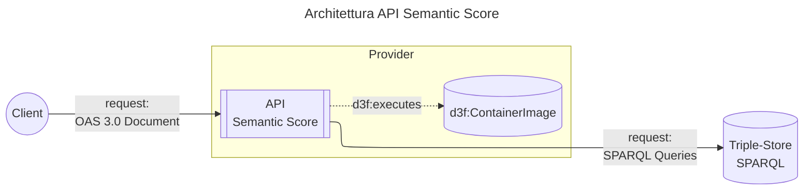

# API Design

## Introduzione

L'API per il calcolo del semantic score è un servizio REST
che calcola il punteggio semantico di documenti OpenAPI 3.0.
Il servizio analizza gli schemi presenti nel documento,
estra le annotazioni semantiche
indicate tramite le [REST API Linked Data Keywords](https://datatracker.ietf.org/doc/draft-polli-restapi-ld-keywords/).
e ne verifica la presenza su un triple-store che espone un'interfaccia SPARQL.

Questa API supporta i progettisti e sviluppatori di API RESTful
nella valutazione del livello di arricchimento semantico
dei propri modelli di dati
e incentiva le pratiche di modellazione semantica.

Per ottenere un Semantic Score basato sugli asset
semantici italiani, è necessario utilizzare
il triple-store pubblicato da <https://schema.gov.it>.

## Requisiti

- Calcolo del Semantic Score per documenti OpenAPI 3.0
- Verifica dello stato del servizio
- Pubblicazione della specifica OpenAPI

## Architettura

Questa API è implementata come un'applicazione
[NestJS](https://nestjs.com/)
e distribuita tramite un container Docker
all'interno del monorepo [schema-editor](https://github.com/teamdigitale/dati-semantic-schema-editor).

L'API espone un'interfaccia REST e si connette a un triple-store SPARQL
per validare le proprietà semantiche dei modelli di dati.

L'applicazione è strutturata in moduli NestJS:

- SemanticScoreModule: Gestisce il calcolo del semantic score.
- HealthModule: Fornisce l'endpoint di health check.
- ConfigModule: Gestisce la configurazione e le variabili d'ambiente.
- ThrottlerModule: Implementa il rate limiting.

Il calcolo del semantic score utilizza la libreria `@teamdigitale/schema-editor-utils` che gestisce:

- la risoluzione dei riferimenti JSON-LD;
- le query verso il server SPARQL;
- il calcolo del punteggio semantico.

Queste funzionalità sono comuni anche al [Schema Editor](../schema-editor/README.md).

Il triple-store di riferimento è [Virtuoso](https://virtuoso.openlinksw.com/).


```mermaid
---
title: Architettura API Semantic Score
config:
  layout: elk
---
graph LR

u((Client))
sparql[(Triple-Store<br>SPARQL)]
subgraph Provider
api[[API<br>Semantic Score]]
image[(d3f:ContainerImage)]
api -.->|d3f:executes| image
end


u --> |"request: <br/>OAS 3.0 Document"| api
api --> |"request:<br/>SPARQL Queries"| sparql

```

## Funzionalità

### Verifica dello status del servizio

L'API espone un endpoint di health check
per monitorare lo stato di salute del servizio.

### Pubblicazione dell'OpenAPI 3.0

La specifica dettagliata dell'API è descritta
nel documento OpenAPI disponibile all'URL `/openapi.yaml`.

### Calcolo Semantic Score

L'API espone un endpoint che:

1. Accetta documenti OpenAPI 3.0 in formato YAML o JSON (dimensione massima: 1MB).
2. Valida la struttura del documento OpenAPI.
3. Analizza i modelli di dati presenti in `#/components/schemas`.
4. Calcola il semantic score per ogni modello basandosi sulle proprietà semantiche validate.
5. Restituisce un oggetto JSON `SemanticScoreResponse` con:
   - `score`: punteggio semantico globale (0-1), calcolato come media aritmetica degli score di tutti i modelli processati;
   - `timestamp`: timestamp Unix del calcolo (millisecondi);
   - `models`: array di `ModelSummary` contenente i dettagli per ogni modello processato.

Ogni `ModelSummary` contiene:

- `name`: nome del modello (chiave in `#/components/schemas`);
- `score`: punteggio semantico del modello (0-1);
- `has_annotations`: indicatore booleano della presenza di `x-jsonld-context`;
- `raw_properties_count`: numero totale di proprietà nel modello;
- `valid_properties_count`: numero di proprietà semanticamente valide;
- `invalid_properties_count`: numero di proprietà non valide o non mappate;
- `properties`: array di `PropertySummary` con dettagli per ogni proprietà.

Ogni `PropertySummary` contiene:

- `name`: nome della proprietà;
- `uri`: URI RDF della proprietà (se mappata) o keyword riservate (@id) o `null`;
- `valid`: indicatore booleano che indica se la proprietà è semanticamente valida.

#### Codici di risposta HTTP

- `200`: Calcolo completato con successo. La risposta contiene l'oggetto `SemanticScoreResponse`.
- `406`: Il documento fornito non è una specifica OpenAPI 3.0 valida.
- `413`: Il file fornito supera la dimensione massima consentita (1MB).
- `415`: Il tipo di media del file non è supportato. Sono accettati solo `application/openapi+yaml` e `application/openapi+json`.
- `429`: Troppe richieste inviate al server (rate limiting attivo).

#### Integrazione col Triple-Store

L'API si connette a un triple-store che espone un'interfaccia SPARQL
per validare le proprietà semantiche dei modelli di dati.
Il processo è il seguente:

1. Per ogni modello di dati con `x-jsonld-context`, l'API estrae le proprietà definite
2. Le proprietà vengono validate interrogando il triple-store tramite query SPARQL
3. Il punteggio viene calcolato come rapporto tra proprietà semantiche valide e totale proprietà

L'indirizzo del triple-store è definito tramite la variabile d'ambiente `SPARQL_URL`.

**Ottimizzazioni e dettagli tecnici:**

- **Caching delle query SPARQL**: Le query SPARQL vengono cachate per ottimizzare le performance e ridurre il carico sul triple-store. Il sistema di cache utilizza un TTL (Time To Live) configurabile per gestire l'invalidazione automatica dei risultati.

- **Proprietà built-in**: Le proprietà con URI che iniziano con `@` (come `@id`, `@type`, `@context`) sono considerate valide senza necessità di query SPARQL, in quanto sono proprietà standard del vocabolario JSON-LD.

- **Query batch**: Le proprietà da validare vengono raggruppate e validate tramite una singola query SPARQL batch, riducendo il numero di richieste al triple-store e migliorando le performance complessive.

#### Processo di calcolo del Semantic Score

Il calcolo del semantic score avviene attraverso una serie di passaggi sequenziali implementati dalla libreria `@teamdigitale/schema-editor-utils`:

**1. Risoluzione del documento OpenAPI**

Il documento OpenAPI viene risolto tramite `resolveOpenAPISpec()` per gestire correttamente i riferimenti JSON Schema (`$ref`). Questo passaggio è fondamentale per:

- Risolvere riferimenti interni ed esterni agli schemi
- Normalizzare la struttura del documento
- Estrarre tutti i modelli di dati da `#/components/schemas`

**2. Estrazione dei modelli di dati**

Vengono processati solo i modelli con `type: "object"`, in quanto rappresentano entità strutturate con proprietà. Per ogni modello viene verificata la presenza di `x-jsonld-context`, che è essenziale per il calcolo dello score semantico.

**3. Risoluzione del contesto JSON-LD**

Se presente `x-jsonld-context`, viene risolto tramite `resolveJsonldContext()`. Il contesto può essere:

- Un oggetto inline direttamente nel documento OpenAPI
- Un riferimento esterno (URL) che punta a un documento JSON-LD

Viene estratto il `@context` che contiene il mapping tra le proprietà JSON Schema (chiavi) e le proprietà RDF (valori URI).

**4. Determinazione delle proprietà da validare**

Per ogni proprietà definita nel modello JSON Schema, viene cercato il mapping corrispondente nel `@context`. Tramite `resolvePropertyByJsonldContext()` viene risolta l'URI RDF corrispondente alla proprietà.

Le proprietà vengono classificate in:

- **Proprietà built-in**: URI che iniziano con `@` (es. `@id`, `@type`) - considerate valide senza query SPARQL
- **Proprietà da validare**: URI RDF standard che richiedono validazione tramite SPARQL

**5. Validazione tramite SPARQL**

Le proprietà con URI non built-in vengono raggruppate e validate tramite una query SPARQL batch. La query verifica l'esistenza delle proprietà nel triple-store:

```sparql
SELECT DISTINCT ?fieldUri WHERE {
  VALUES ?fieldUri { <uri1> <uri2> <uri3> ... }
  ?fieldUri [] [] .
}
```

Questa query controlla che ogni URI esista nel triple-store e abbia almeno una tripla associata. I risultati vengono cachati per ottimizzare le performance nelle richieste successive.

**6. Calcolo dello score per modello**

Per ogni modello, lo score viene calcolato come:

```
score = valid_properties_count / raw_properties_count
```

Dove:

- `valid_properties_count`: numero di proprietà semanticamente valide (proprietà built-in + proprietà validate tramite SPARQL)
- `raw_properties_count`: numero totale di proprietà nel modello

**Casi speciali:**

- Se il modello non ha `x-jsonld-context`, lo score è `0`
- Se il modello non ha proprietà (`raw_properties_count = 0`), lo score è `0`
- Se tutte le proprietà sono valide, lo score è `1`

**7. Calcolo dello score globale**

Lo score globale rappresenta la qualità semantica complessiva del documento OpenAPI ed è calcolato come media aritmetica degli score di tutti i modelli processati:

```
score_globale = sum(score_modello_i) / numero_modelli
```

Se non ci sono modelli da processare, lo score globale è `0`.

Il risultato finale è un valore decimale compreso tra `0` e `1`, dove:

- `0`: nessuna proprietà semanticamente valida
- `1`: tutte le proprietà sono semanticamente valide
- Valori intermedi: indicano la percentuale di proprietà semanticamente valide

### Service Management

#### Rate Limiting

L'API implementa un sistema di rate limiting utile
a definire dei livelli di servizio:

- Limite: 15 richieste per finestra temporale (configurabile via `THROTTLE_LIMIT`)
- Finestra temporale: 60 secondi (configurabile via `THROTTLE_TTL`)
- Risposta: Status code `429 Too Many Requests` quando il limite viene superato

#### Gestione dei dati di ingresso

- Helmet: Middleware per la sicurezza HTTP
- CORS: Configurabile tramite variabile d'ambiente
- Validazione input: Validazione automatica dei documenti OpenAPI
- Limite delle richieste HTTP: Massimo 1MB per richiesta

## Deployment

Il deployment avviene tramite l'immagine Docker
pubblicata su GitHub Container Registry del repository:
non sono supportate altre modalità di deployment.

### Prerequisiti

- SparQL:
  Assicurarsi che l'endpoint SPARQL sia accessibile dall'ambiente di deployment
- Rate Limiting:
  Regolare i parametri `THROTTLE_LIMIT` e `THROTTLE_TTL` in base al carico atteso
- CORS:
  Configurare `CORS_ORIGIN` con le origini effettive in produzione (evitare `*`)
- Logging:
  I log sono abilitati in produzione per il monitoraggio
- Swagger:
  La documentazione Swagger è disabilitata in produzione

### Configurazione

L'applicazione supporta le seguenti configurazioni,
implementate tramite variabili d'ambiente:

| Variabile        | Descrizione                           | Default       | Obbligatoria |
| ---------------- | ------------------------------------- | ------------- | ------------ |
| `SPARQL_URL`     | URL endpoint SPARQL                   | -             | Sì           |
| `NODE_ENV`       | Ambiente di esecuzione                | `development` | No           |
| `PORT`           | Porta su cui ascoltare                | `3000`        | No           |
| `CORS_ORIGIN`    | Origini CORS consentite               | `*`           | No           |
| `THROTTLE_TTL`   | Finestra temporale rate limiting (ms) | `60000`       | No           |
| `THROTTLE_LIMIT` | Numero massimo richieste per finestra | `15`          | No           |

#### Esempio File `.env`

```env
NODE_ENV=production
PORT=3000
CORS_ORIGIN=https://example.com
THROTTLE_TTL=60000
THROTTLE_LIMIT=15
SPARQL_URL=https://virtuoso.example.com/sparql
```

## Sviluppo

### Prerequisiti {#sviluppo-prerequisiti}

- Node.js (versione compatibile con NestJS)
- Accesso a un endpoint SPARQL
- Variabili d'ambiente configurate

### Build e Avvio

Per il deployment in ambiente locale, vanno eseguiti i seguenti passaggi:

1. Installazione dipendenze:

   ```bash
   pnpm install
   ```

2. Build dell'applicazione:

   ```bash
   cd apps/api
   pnpm run build
   ```

3. Avvio in produzione:

   ```bash
   pnpm run start:prod
   ```

### Docker

L'applicazione può essere deployata utilizzando Docker.
Assicurarsi di configurare le variabili d'ambiente nel container:

```bash
docker build --target api --tag api:latest .
```

```bash
docker run -d \
  -p 3000:3000 \
  -e NODE_ENV=production \
  -e PORT=3000 \
  -e SPARQL_URL=https://virtuoso.example.com/sparql \
  -e THROTTLE_LIMIT=15 \
  -e THROTTLE_TTL=60000 \
  api:latest
```
